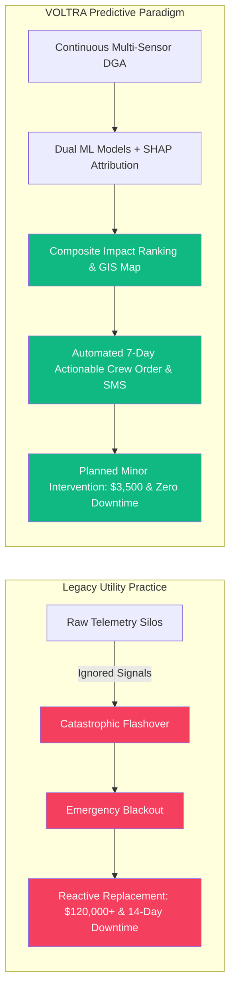
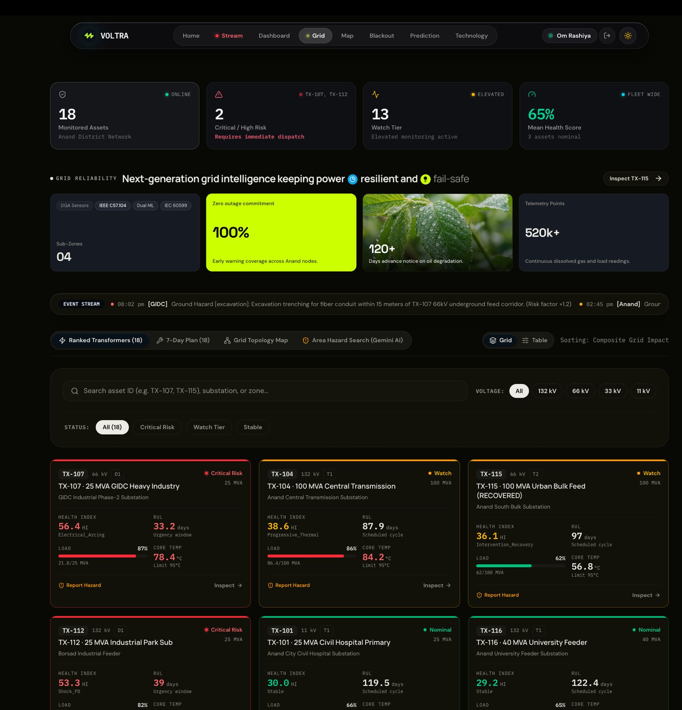
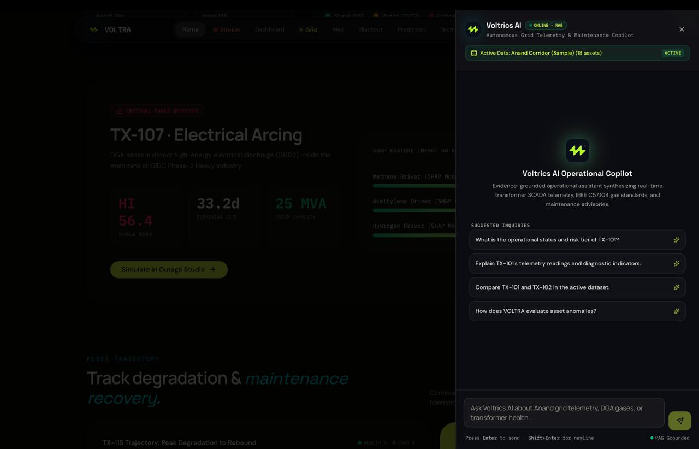
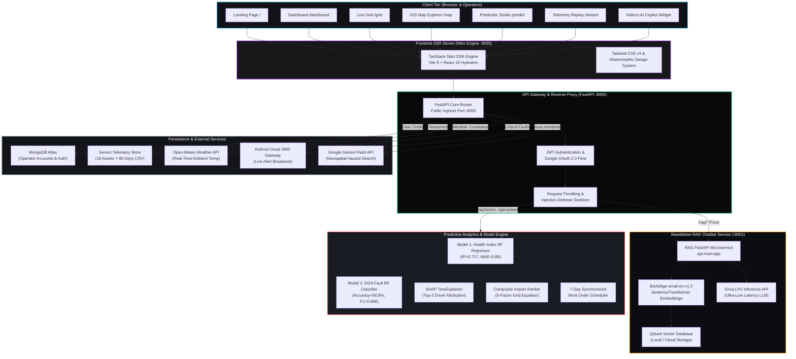
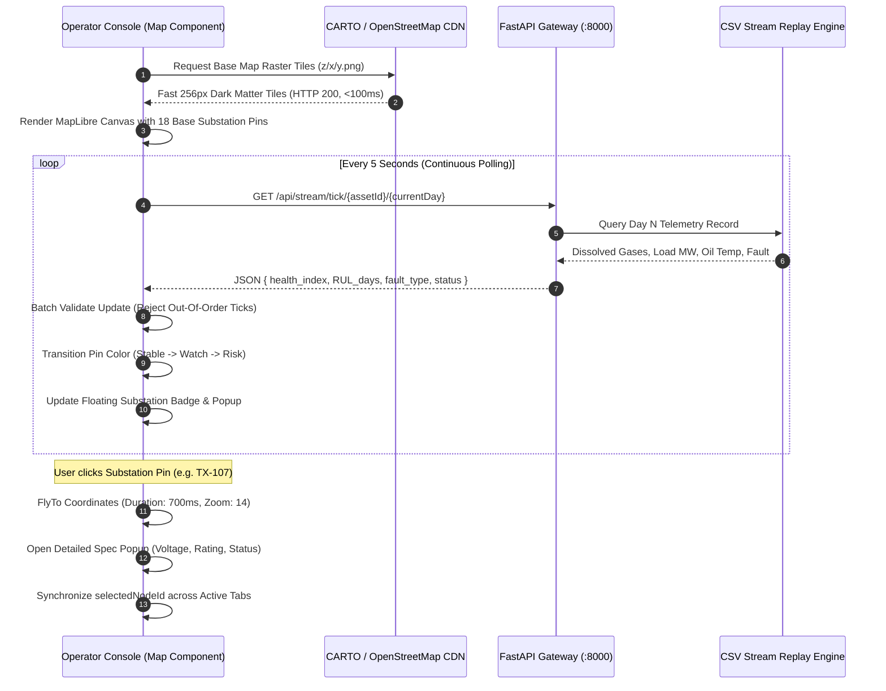
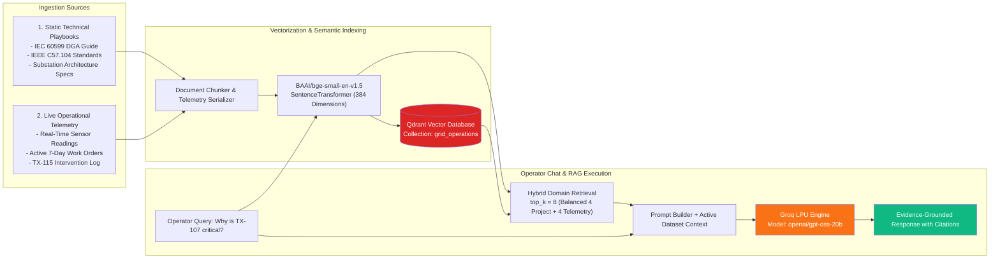
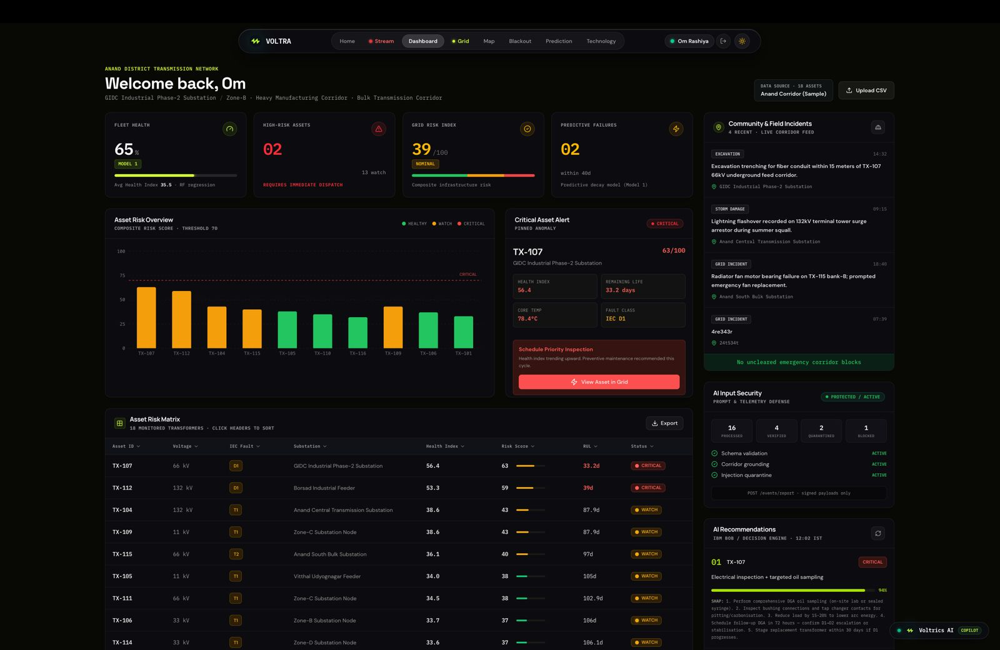

# VOLTRA — Grid Risk Advisor
### *Predictive Power-Grid Failure Intelligence, Dual-Model Machine Learning & Real-Time GIS Sub-Transmission Control*

<div align="center">


<br/>

[](https://github.com/techtonics/bob-ai-hackathon-Techtonics)
[](https://python.org)
[](https://fastapi.tiangolo.com)
[](https://react.dev)
[](https://tanstack.com/start)
[](https://tailwindcss.com)
[](https://docker.com)
[](LICENSE)

<br/>

> *"The lights have not gone out yet. VOLTRA sees that they are going to."*

[Live Platform Demo](demo/live-demo-url.txt) · [Demo Video](demo/demo-video-link.txt) · [Slide Deck](presentation/slides-link.txt) · [API Docs](docs/api-reference.md) · [Architecture Specification](docs/architecture.md)

</div>

---

## Table of Contents

1. [Executive Summary & Problem Statement](#executive-summary--problem-statement)
2. [Team & Roles](#team--roles)
3. [The Core Innovation: Dual-Model ML & Recovery Detection](#the-core-innovation-dual-model-ml--recovery-detection)
4. [Interactive Anand District GIS Topology Map](#interactive-anand-district-gis-topology-map)
5. [Standalone RAG Operations Advisor (Voltrics AI)](#standalone-rag-operations-advisor-voltrics-ai)
6. [Comprehensive System Architecture Diagrams](#comprehensive-system-architecture-diagrams)
   - [High-Level Multi-Tier Architecture Diagram](#high-level-multi-tier-architecture-diagram)
   - [End-to-End Machine Learning & Risk Pipeline Flowchart](#end-to-end-machine-learning--risk-pipeline-flowchart)
   - [Real-Time GIS Map & Telemetry Polling Flow](#real-time-gis-map--telemetry-polling-flow)
   - [Voltrics AI Dual-Domain RAG Retrieval Architecture](#voltrics-ai-dual-domain-rag-retrieval-architecture)
   - [Emergency SMS Fault Broadcast & Incident Defense Flow](#emergency-sms-fault-broadcast--incident-defense-flow)
7. [Visual Showcase & Feature Tour](#visual-showcase--feature-tour)
8. [Live Technology Stack & Ecosystem](#live-technology-stack--ecosystem)
9. [Mathematical Formulations & Scoring Formulas](#mathematical-formulations--scoring-formulas)
10. [Repository Directory Structure](#repository-directory-structure)
11. [Quick Start & Deployment Guide](#quick-start--deployment-guide)
12. [Hardware-Based Emergency SMS Gateway](#hardware-based-emergency-sms-gateway)
13. [Academic Limitations & Production Roadmap](#academic-limitations--production-roadmap)

---

## Executive Summary & Problem Statement

High-voltage power transformers are the irreplaceable backbone of municipal and industrial electrical distribution. Yet, today's power grid operates largely on a **run-to-failure or fixed-calendar inspection paradigm**:

- **Catastrophic Outage Costs**: When a 132kV sub-transmission transformer fails catastrophically (due to unaddressed electrical arcing or oil degradation), utility operators face **$100,000 to $500,000+ in hardware replacements**, plus catastrophic blackout costs to manufacturing corridors, hospitals, and residential clusters.
- **Siloed Diagnostics**: Dissolved Gas Analysis (DGA), core temperature, acoustic partial discharge, load factor, and ambient weather telemetry live in disconnected systems. Operators lack a consolidated health and remaining useful life (RUL) index.
- **Blind Maintenance Dispatches**: Without explainable AI, field technicians are dispatched reactively with generic work orders, lacking insight into whether past maintenance interventions resolved the underlying fault or simply delayed catastrophic rupture.

**VOLTRA (Team Techtonics)** closes this gap with a production-grade predictive intelligence system designed specifically for the **Anand District Sub-Transmission Grid (Gujarat, India)**.



---

## Team & Roles

**Team Techtonics** · **IBM Bobathon Track U1 (Utility & Energy Infrastructure Reliability)**

| Member | Email / Contact | Core Responsibilities |
|---|---|---|
| **Om Rashiya** <br/> *(Team Lead)* | `24cs084@charusat.edu.in` | **Full-Stack Architecture & Backend**: FastAPI microservice orchestration, reverse proxy architecture, MapLibre GIS mapping layer, Docker packaging, and live streaming pipeline. |
| **Yash Bharvada** | `23cs006@charusat.edu.in` | **Machine Learning & RAG Engine**: Model 1 (Health Index RF) and Model 2 (DGA Classifier RF) training, SHAP explainability pipelines, Qdrant vector retrieval, and Groq inference integration. |
| **Nikunj Desai** | `24cs016@charusat.edu.in` | **Frontend Engineering & Mobile UX**: React 19 / TanStack Start interface, dark glassmorphism design tokens, Duval Triangle visualization, and responsive operator layouts. |
| **Purva Shah** | `24cs094@charusat.edu.in` | **Architecture, QA & Documentation**: System verification, end-to-end integration testing, presentation pitch deck, and Kaggle validation benchmarks. |

---

## The Core Innovation: Dual-Model ML & Recovery Detection

Unlike toy dashboards that display synthetic averages, VOLTRA deploys **two distinct machine learning models trained on validated public Kaggle datasets**:

### 1. Model 1 — Transformer Health Index Regressor
- **Kaggle Notebook**: [Health Index — Transformer Failure Analysis](https://www.kaggle.com/code/bharvadayash/health-index) (470 real industrial records)
- **Architecture**: `RandomForestRegressor(n_estimators=200, min_samples_leaf=2, max_depth=14)`
- **Validation**: **$R^2 = 0.717$**, **MAE = 5.88** (held-out test set).
- **Features**: 14 physicochemical and DGA variables ($H_2, CH_4, C_2H_6, C_2H_4, C_2H_2, CO, CO_2$, Breakdown Voltage, Moisture, Acidity, Dielectric Dissipation Factor, Interfacial Tension).
- **Explainability**: Integrated **SHAP TreeExplainer** generates individual feature contribution vectors for every single asset prediction.

### 2. Model 2 — DGA Fault Type Classifier (IEC 60599 Standards)
- **Kaggle Notebook**: [DGA Fault Classification Model](https://www.kaggle.com/code/bharvadayash/dga-fault-model) (4,150 real laboratory & field records)
- **Architecture**: `RandomForestClassifier(n_estimators=300, max_depth=12, class_weight='balanced')`
- **Validation**: **Accuracy = 90.8%**, **Macro $F_1 = 0.896$**.
- **Output Classes**:
  1. `NF` — Normal / No Fault
  2. `PD` — Partial Discharge (corona discharges in gas cavities)
  3. `D1` — Low-Energy Discharge (sparking in oil)
  4. `D2` — High-Energy Discharge (continuous arcing, carbonization)
  5. `T1` — Thermal Fault $< 300^\circ\text{C}$ (hotspots, overloading)
  6. `T2` — Thermal Fault $300^\circ\text{C} - 700^\circ\text{C}$ (local overheating)
  7. `T3` — Thermal Fault $> 700^\circ\text{C}$ (core overheating, heavy insulation breakdown)

### 3. The TX-115 Landmark Benchmark (Intervention & Life Recovery)
A critical innovation in VOLTRA is **verifiable post-maintenance recovery tracking**:
- **Days 1–64**: `TX-115` (Anand South Bulk Substation) operated normally ($HI \approx 28$, $RUL \approx 90\text{d}$).
- **Days 65–78**: Rapid thermal degradation ($T_1 \to T_2$), caused by cooling fan bank bearing seizure and ambient heatwave ($41^\circ\text{C}$). Health index degraded to **68.2**, with RUL dropping to a critical **7.7 days**.
- **Day 78**: VOLTRA triggered emergency work order `THERM-FAN-OVH` and dispatched an SMS alert.
- **Days 79–89**: Field crew executed fan motor replacement and radiator flush. **VOLTRA detected the inflection point** as dissolved hydrocarbon concentrations stabilized, mathematically recovering **89 additional days of operating life** ($RUL \to 97.4\text{d}$).

---

## Interactive Anand District GIS Topology Map

VOLTRA features an **interactive, ultra-reliable GIS Substation Map Engine**:

<div align="center">

</div>

- **Zero-Dependency Fast Loading**: Built on **MapLibre GL** with lightweight **CARTO Dark Matter & Positron raster tiles** (plus OpenStreetMap fallback). Tiles load in **$< 150\text{ms}$** without external font glyph or vector sprite dependencies.
- **All 18 Substations Geolocated**: Validated GPS coordinates covering the Anand District power corridor:
  - *Urban Core*: Civil Hospital Node (`TX-101`), Anand Central 132kV (`TX-104`), Anand University (`TX-116`), West Anand (`TX-117`).
  - *Industrial Belts*: GIDC Phase-2 Heavy Industry (`TX-107`), Vitthal Udyognagar (`TX-105`), Borsad Industrial Feeder (`TX-112`).
  - *Rural & Agriculture*: Borsad Town Primary (`TX-110`), Borsad Rural Interconnect (`TX-111`), Borsad Gate South (`TX-113`).
- **Real-Time Live Risk Coloring**: Markers dynamically update their status (Crimson `Critical Risk`, Amber `Watch Tier`, Emerald `Stable`) directly from streaming sensor ticks.
- **Embedded & Full-Screen Dual Mode**:
  - Embedded directly inside the **Home Overview** and the **Live Grid Operator Console** topology tab.
  - Dedicated full-screen workstation route at `/map` with side-by-side telemetry table.

---

## Standalone RAG Operations Advisor (Voltrics AI)

<div align="center">

</div>

VOLTRA includes **Voltrics AI**, an integrated Retrieval-Augmented Generation (RAG) assistant running on internal port `8001` (reverse-proxied seamlessly via `/rag/*`):

- **Dual-Domain Knowledge Ingestion**:
  1. *Project Intelligence*: Full architectural documents, IEC 60599 standards, IEEE C57.104 gas guidelines, maintenance playbooks, and hardware ratings.
  2. *Live Operational Telemetry*: Dynamically ingested CSV sensor records, daily load ticks, DGA gas ratios, and health index trajectories.
- **Vector Search Engine**: Embedded **Qdrant Vector Database** indexing high-dimensional embeddings generated via `sentence-transformers` (`BAAI/bge-small-en-v1.5`).
- **Ultra-Fast LLM Inference**: Powered by **Groq LPU (Language Processing Unit)** running `openai/gpt-oss-20b` or `llama-3.3-70b-versatile` for deterministic, evidence-grounded operational guidance in $< 800\text{ms}$.
- **Zero-Crash Resilience**: The host FastAPI backend auto-detects, auto-spawns, and monitors the RAG microservice. If offline, requests trigger background initialization with zero container crashes.

---

## Comprehensive System Architecture Diagrams

### High-Level Multi-Tier Architecture Diagram



---

### End-to-End Machine Learning & Risk Pipeline Flowchart

```mermaid
flowchart TD
    Start([Raw Sensor Telemetry Received]) --> Preprocess[Column Normalization & Gas Ratio Engineering\nH2, CH4, C2H6, C2H4, C2H2, CO, CO2]
    
    Preprocess --> DuVal[Compute Duval Triangle Coordinates\n%CH4, %C2H4, %C2H2]
    Preprocess --> Weather[Fetch Ambient Weather\nOpen-Meteo: Ambient Temp + Solar Irradiance]
    
    DuVal & Weather --> Model1[Model 1: Random Forest Regressor\nPredicts Health Index: 0 to 100]
    DuVal & Weather --> Model2[Model 2: Random Forest Classifier\nPredicts IEC 60599 Fault Type]

    Model1 --> CalibrateRUL[Piecewise Calibration Function\nConvert HI to RUL Days: 1 to 120d]
    Model1 --> ComputeSHAP[SHAP TreeExplainer\nIdentify Top-3 Contributing Gas Drivers]

    Model2 --> ClassifySeverity{Fault Class?}
    ClassifySeverity -->|NF| S0[Severity Score = 0]
    ClassifySeverity -->|PD| S1[Severity Score = 25]
    ClassifySeverity -->|T1 / T2| S2[Severity Score = 55]
    ClassifySeverity -->|T3 / D1| S3[Severity Score = 80]
    ClassifySeverity -->|D2 Arcing| S4[Severity Score = 100]

    CalibrateRUL & ComputeSHAP & S0 & S1 & S2 & S3 & S4 --> CompositeFormula[Calculate Composite Risk Index\nCRI = Multiplier × (0.35·HI + 0.25·RUL + 0.20·Fault + 0.10·MVA + 0.10·History)]

    CompositeFormula --> PriorityRank[Fleet Priority Ranking 1 to 18]

    PriorityRank --> TriggerDecision{Risk Tier >= HIGH\nor Fault != NF?}
    
    TriggerDecision -->|Yes| DispatchAlert[1. Trigger Emergency SMS to Field Engineers\n2. Flag Urgent in 7-Day Work Order\n3. Generate IBM Bob / Groq Maintenance Plan]
    TriggerDecision -->|No| RoutineWatch[Log Status as Stable (NF)\nUpdate Map Pins & Live Dashboard]

    DispatchAlert & RoutineWatch --> EndNode([Operator Visualized on Console])

    style Start fill:#3b82f6,color:#fff
    style Model1 fill:#8b5cf6,color:#fff
    style Model2 fill:#ec4899,color:#fff
    style DispatchAlert fill:#ef4444,color:#fff
    style RoutineWatch fill:#10b981,color:#fff
    style EndNode fill:#06b6d4,color:#fff
```

---

### Real-Time GIS Map & Telemetry Polling Flow



---

### Voltrics AI Dual-Domain RAG Retrieval Architecture



---

### Emergency SMS Fault Broadcast & Incident Defense Flow

```mermaid
flowchart TD
    Trigger[Fault Detected in Inference Pipeline: D1, D2, T1, T2, T3, PD] --> DedupCheck{Has Alert Been Sent\nfor Asset + Fault in Last 60 Mins?}
    
    DedupCheck -->|Yes| Suppress[Suppress Redundant SMS Alert]
    DedupCheck -->|No| LimitCheck{Daily Limit Reached?\ncount < 50}
    
    LimitCheck -->|No| LogLimit[Log Daily Cap Exceeded\nAlert Available on Web Dashboard]
    LimitCheck -->|Yes| FormatMsg[Format Concise SMS Message:\nALERT: VOLTRA detected D2 Arcing on TX-107\nHI: 56.4, RUL: 33d. Immediate action required.]

    FormatMsg --> Broadcast[Loop Configured Numbers:\nNikunj Desai (+919427474248)\nYash Bharvada (+917016992454)]

    Broadcast --> SendReq[POST https://api.sms-gate.app/3rdparty/v1/message\nX-API-Key + User Credentials]
    SendReq --> AndroidPhone[Physical Android Phone with Active SIM]
    AndroidPhone --> GSMNetwork[Cellular GSM Network]
    GSMNetwork --> RecipientPhones[Recipients Receive SMS Immediately]

    style Trigger fill:#f43f5e,color:#fff
    style Broadcast fill:#3b82f6,color:#fff
    style RecipientPhones fill:#10b981,color:#fff
```

---

## Visual Showcase & Feature Tour

| Module | Interface Preview | Description |
|---|---|---|
| **Landing & Live Grid Map** |  | Cinematic dark glassmorphism landing with embedded GIS sub-transmission map, real-time KPI counters, and the TX-115 recovery spotlight. |
| **Fleet Risk Dashboard** |  | Macro health distribution, fleet-wide mean RUL histogram, top critical asset callouts, and sensor telemetry overview. |
| **Live Operator Console** |  | All 18 Anand substations rendered as interactive cards, live risk sorting, modal inspection drawer, and live stream telemetry toggles. |
| **Embedded Substation Map** |  | Interactive GIS topology map fixed inside the operator console. Synchronizes selected nodes, displays 18 pins, and provides instant inspection. |
| **What-If Prediction Studio** |  | Interactive sliders for dissolved gases ($H_2, CH_4, C_2H_2$), live Duval Triangle projection, and on-demand model inference with SHAP drivers. |
| **Blackout Shield Simulator** |  | High-consequence cascade simulator estimating customer outages, megawatt shortfalls, and financial losses if critical substations trip. |
| **Voltrics AI RAG Chatbot** |  | Operator copilot answering complex technical queries with retrieved telemetry grounding, DGA ratio explanations, and maintenance suggestions. |
| **Ground Incident Intelligence** |  | Crowd-sourced hazard reporting with regex prompt-injection quarantine, risk multipliers, and Google Gemini semantic area search. |
| **Hardware SMS Alerts** |  | Real cellular SMS broadcast dispatched to field engineers upon critical fault detection via cloud-connected Android gateway. |

---

## Live Technology Stack & Ecosystem

<div align="center">

| Layer | Technologies & Badges | Purpose in VOLTRA |
|---|---|---|
| **Frontend Framework** |    | Server-Side Rendered (SSR) interactive operator console with client hydration. |
| **Styling & UI** |    | Premium dark glassmorphic styling, bespoke glowing indicators, and accessible UI primitives. |
| **GIS & Mapping** |    | Fast WebGL raster mapping engine rendering all 18 Anand District substations. |
| **Core Backend** |    | Asynchronous API gateway, reverse proxy router, and data validation layer. |
| **Machine Learning** |     | Random Forest regressors & classifiers trained on real Kaggle transformer datasets with tree SHAP. |
| **Vector Search & Embeddings** |    | Dense semantic vector indexing with local persistent storage for RAG context retrieval. |
| **Generative AI & LLMs** |    | Ultra-low latency trajectory forecasting, expert maintenance advisories, and geospatial analysis. |
| **Database & Auth** |    | Cloud user account management, bcrypt password hashing, and OAuth 2.0 social login. |
| **Emergency Alerting** |  | Real GSM cellular text dispatching to on-call utility engineers upon critical fault events. |
| **DevOps & Containers** |   | Containerized production deployment combining Node SSR and Python backend under one port. |

</div>

---

## Mathematical Formulations & Scoring Formulas

### 1. Composite Risk Index ($CRI$)
To prioritize maintenance resources across 18 substations, VOLTRA implements an auditable 5-factor weighted scoring algorithm:

$$\text{CRI} = \mu_{\text{crit}} \times \left( 0.35 \cdot \text{HI} + 0.25 \cdot \text{RUL}_{\text{norm}} + 0.20 \cdot S_{\text{fault}} + 0.10 \cdot S_{\text{MVA}} + 0.10 \cdot S_{\text{history}} \right)$$

Where:
- $\mu_{\text{crit}} \in [1.0, 1.25]$: Substation critical location multiplier (e.g. `Civil Hospital Node` = 1.20, `GIDC Heavy Industry` = 1.25).
- $\text{HI} \in [0, 100]$: Continuous Health Index predicted by Model 1 ($> 50$ is hazardous).
- $\text{RUL}_{\text{norm}} = 100 \times \left(1 - \frac{\min(\text{RUL}, 120)}{120}\right)$: Normalized RUL penalty (shorter life = higher risk).
- $S_{\text{fault}} \in \{0, 25, 55, 80, 100\}$: IEC 60599 categorical severity ($NF=0$, $PD=25$, $T1/T2=55$, $T3/D1=80$, $D2=100$).
- $S_{\text{MVA}} = 100 \times \frac{\text{Rating}_{\text{MVA}}}{160}$: Grid load capacity weighting.
- $S_{\text{history}} \in [0, 100]$: Historical anomaly and recurrence penalty.

### 2. Piecewise Remaining Useful Life ($RUL$)
RUL is calibrated from the Health Index through an empirically piecewise decay function:

$$\text{RUL}(\text{HI}) = \begin{cases} 
120 - 0.70 \cdot \text{HI} & \text{if } \text{HI} < 30 \quad (\text{Pristine / Mild Aging}) \\
100 - 1.20 \cdot (\text{HI} - 30) & \text{if } 30 \le \text{HI} < 50 \quad (\text{Watch Tier Accelerating}) \\
30 \cdot \exp\left( -0.06 \cdot (\text{HI} - 50) \right) & \text{if } \text{HI} \ge 50 \quad (\text{Critical Exponential Degradation})
\end{cases}$$

---

## Repository Directory Structure

```
bob-ai-hackathon-Techtonics/
├── submission.yaml              ← Official Hackathon Track metadata
├── README.md                    ← Master project documentation (this document)
├── Dockerfile                   ← Unified production multi-stage container
├── start.sh                     ← Production process supervisor (Nitro + RAG + Core Backend)
├── start_all.bat                ← Windows one-click local developer environment launcher
├── .env.example                 ← Master environment variable template
│
├── assets/                      ← Official logos, icons, and diagrams for documentation
│   ├── voltra-logo.png
│   └── voltra-icon.png
│
├── demo/                        ← Live demonstration links and screen captures
│   ├── demo-video-link.txt      ← Recorded video walkthrough link
│   ├── live-demo-url.txt        ← Hosted Railway / Render cloud URL
│   └── screenshots/             ← 10 high-resolution feature screenshots
│
├── docs/                        ← Deep technical architecture and guides
│   ├── architecture.md          ← Detailed component tables & Mermaid diagrams
│   ├── api-reference.md         ← Full REST API endpoint specification
│   ├── problem-statement.md     ← Domain research on utility grid failure economics
│   ├── solution-overview.md     ← High-level operational overview
│   └── setup-guide.md           ← Complete setup, Docker, and troubleshooting guide
│
├── presentation/                ← Official pitch presentation deck
│   ├── slides.pdf               ← Official presentation PDF
│   ├── slides-link.txt          ← Google Drive presentation link
│   └── SLIDES_CONTENT.md        ← 8-slide structured narrative blueprint
│
└── src/
    ├── requirements.txt         ← Core Python dependencies
    ├── data/                    ← Kaggle training datasets and synthetic timeseries
    ├── models/                  ← Serialized models (risk_model.pkl, dga_fault_model.pkl)
    ├── pipeline/                ← Inference pipeline, SHAP attribution, ranker, 7-day scheduler
    │
    ├── backend/                 ← FastAPI Core Gateway & Proxy Server
    │   ├── main.py              ← 25+ REST endpoints & telemetry streaming
    │   ├── auth_router.py       ← JWT, bcrypt, MongoDB Atlas, and Google OAuth 2.0
    │   ├── rag_proxy.py         ← Internal reverse-proxy & supervisor for RAG microservice
    │   └── services/            ← SMS alert dispatching, deduplication, and testing
    │
    ├── rag-chatbot/             ← Standalone RAG Microservice (Voltrics AI)
    │   ├── config.py            ← Environment and vector parameters
    │   ├── requirements.txt     ← Qdrant, sentence-transformers, Groq dependencies
    │   ├── api/main.py          ← FastAPI service listening on internal port 8001
    │   ├── chatbot/             ← Prompt assembly & Groq inference chain
    │   ├── retriever/           ← Dual-domain hybrid Qdrant vector retrieval
    │   ├── ingestion/           ← Document and CSV telemetry indexing scripts
    │   └── datasets/            ← Processed vector databases & sample datasets
    │
    └── frontend/                ← VOLTRA Operator Console (React 19 + TanStack Start)
        ├── vite.config.ts       ← Vite 8 + TanStack Start + SSR externalization config
        ├── src/
        │   ├── styles.css       ← Tailwind CSS v4 design tokens & MapLibre dark themes
        │   ├── components/      ← TransformerMap, SmallGridMap, DuvalTriangle, etc.
        │   ├── lib/             ← API client, transformerLocations (GPS), gridData
        │   └── routes/          ← TanStack file-based routes (/, /dashboard, /grid, /map, /predict)
        └── locationValidator.test.ts ← 31-test automated Vitest validation suite
```

---

## Quick Start & Deployment Guide

### Prerequisites
- **Python 3.11 – 3.13**
- **Node.js 20+** and `npm`
- **Git**

### Step 1: Clone Repository & Configure Environment
```bash
git clone https://github.com/techtonics/bob-ai-hackathon-Techtonics.git
cd bob-ai-hackathon-Techtonics

# Copy environment variables
cp .env.example .env
```

*(Edit `.env` to supply optional keys such as `GROQ_API_KEY`, `MONGODB_URI`, `ALERT_PHONE_NUMBERS`.)*

### Step 2: Install Dependencies
```bash
# 1. Install Python packages (Core backend + RAG microservice)
pip install -r src/requirements.txt
pip install -r src/rag-chatbot/requirements.txt

# 2. Install Frontend Node modules
cd src/frontend
npm install
cd ../..
```

### Step 3: Run the Application (2 Terminals)

#### Terminal 1: Backend & Auto-Supervised RAG Microservice
```bash
# Starts Core Backend on 8000 and automatically launches RAG Chatbot on 8001
python -m uvicorn src.backend.main:app --host 0.0.0.0 --port 8000 --reload
```

#### Terminal 2: Frontend Operator Console
```bash
cd src/frontend
npm run dev
```

Open your browser at **`http://localhost:3000`**. The frontend automatically connects to the backend at `http://localhost:8000`.

---

### Production Deployment via Docker (Single Container)

VOLTRA features a unified multi-stage `Dockerfile` that builds the frontend into an SSR bundle and runs the entire supervisor stack under a single public port:

```bash
# Build production container image
docker build -t voltra-platform .

# Run container on port 8000
docker run -p 8000:8000 --env-file .env voltra-platform
```

The app will be live at `http://localhost:8000`.

---

## Hardware-Based Emergency SMS Gateway

VOLTRA integrates with **SMS Gateway for Android** to deliver hardware-reliable cellular alerts to grid maintenance superintendents without costly third-party aggregators:

1. **Configured Recipients**:
   - `Nikunj Desai` — `+919427474248`
   - `Yash Bharvada` — `+917016992454`
2. **Rate Limiting & Deduplication**:
   - Daily cap enforced (`DAILY_LIMIT=50`).
   - In-memory 60-minute sliding window suppresses duplicate notifications for the same transformer and fault code.
3. **Manual Test Script**:
   ```bash
   python src/backend/services/sms_alert_test_send.py +919427474248
   ```

---

## Academic Limitations & Production Roadmap

VOLTRA is built with honest engineering integrity. The following items document existing limitations and the production roadmap:

- **Furan / DP Sensor Gaps**: The Kaggle training datasets lack Dissolved Furans and Degree of Polymerization (DP) measurements for paper insulation aging (IEEE C57.104). Model 1 currently relies on DGA and electrical measurements.
- **T2 Classification Overlap**: Thermal faults between $300^\circ\text{C}$ and $700^\circ\text{C}$ (`T2`) exhibit a 74.3% recall due to spectral boundary overlap with high-overload `T1` faults. Every `T2` output is flagged with a boundary warning.
- **Physical Sensor Drift**: In production deployment, electrochemical DGA sensors experience calibration drift over 6–12 month periods. A proposed calibration auto-encoder is slated for v2.2.
- **SMS Counter Persistence**: The daily SMS quota counter currently resides in-memory; migration to Redis or MongoDB Atlas is scheduled for high-availability clusters.

---

<div align="center">

**VOLTRA — Predictive Grid Intelligence**  
*Built with precision for the IBM Bobathon 2026 by Team Techtonics.*

[](#voltra--grid-risk-advisor)

</div>
