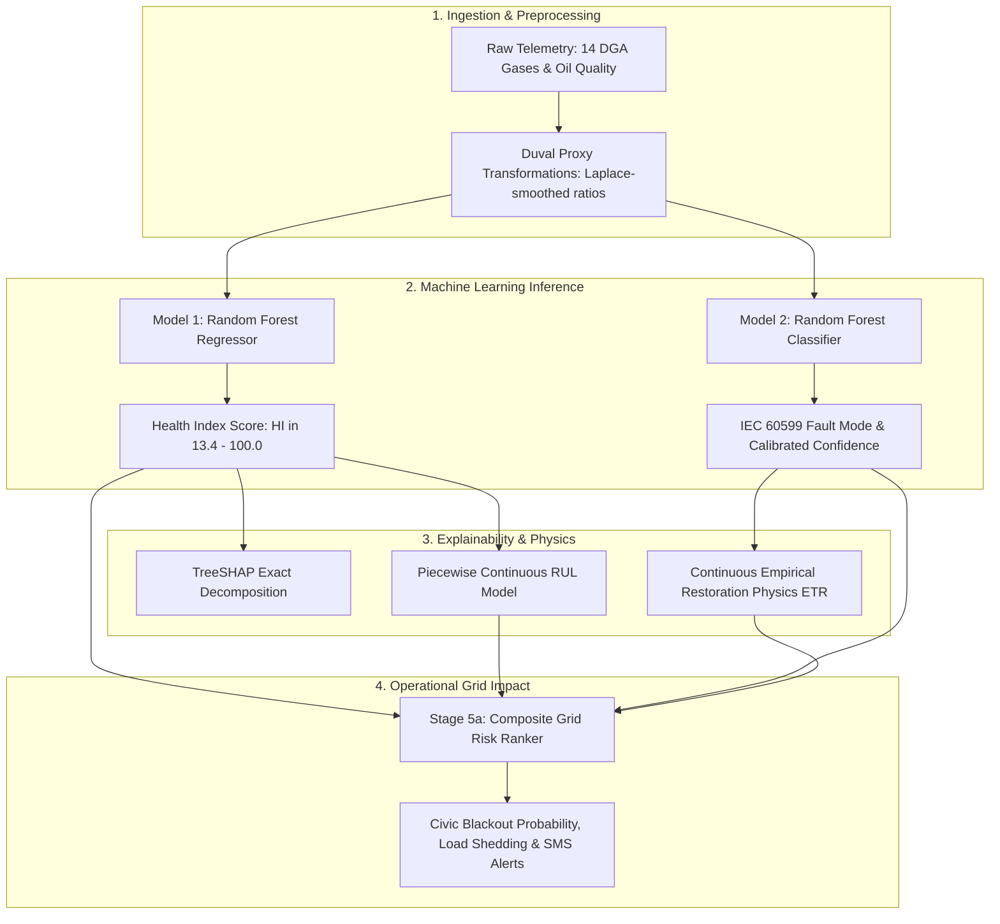

# VOLTRA Grid Intelligence Platform — Mathematical Formulations, ML Architectures & Value Analysis

> **Target Standards:** IEEE C57.104-2019, IEEE C57.91-2011, IEC 60599 Ed. 3.0  
> **Target Grid:** Anand District Power Distribution Network (18 MGVCL Substations)  
> **Validation Datasets:** Kaggle Failure Analysis in Power Transformers (470 records) & Kaggle DGA Dataset (4,150 records)  
> **Word Document Download:** Direct download available via [`http://localhost:8000/api/docs/model-formulas/docx`](http://localhost:8000/api/docs/model-formulas/docx) or local file at [`VOLTRA_MODEL_FORMULAS_AND_SPECS.docx`](file:///Users/omvipulbhairashiya/Downloads/projects/bob-ai-hackathon-Techtonics/VOLTRA_MODEL_FORMULAS_AND_SPECS.docx)

---

## Table of Contents
1. [Executive Summary & Mathematical Architecture](#1-executive-summary--mathematical-architecture)
2. [Model 1 — Health Index Regression (Damage Score)](#2-model-1--health-index-regression-damage-score)
3. [Remaining Useful Life (RUL) & Risk Tier Formulations](#3-remaining-useful-life-rul--risk-tier-formulations)
4. [Model 2 — DGA Fault Classification (IEC 60599 & Duval Triangles)](#4-model-2--dga-fault-classification-iec-60599--duval-triangles)
5. [Stage 5a — Multi-Criteria Composite Grid Impact Ranking](#5-stage-5a--multi-criteria-composite-grid-impact-ranking)
6. [Continuous Physics & Empirical ETR (Estimated Time to Restore)](#6-continuous-physics--empirical-etr-estimated-time-to-restore)
7. [Blackout Risk, Load Physics & Downstream Civic Quantification](#7-blackout-risk-load-physics--downstream-civic-quantification)
8. [Micro-Climate Atmospheric Coupling & Arrhenius Aging Rate](#8-micro-climate-atmospheric-coupling--arrhenius-aging-rate)
9. [90-Day Synthetic Degradation & Recovery Physics](#9-90-day-synthetic-degradation--recovery-physics)
10. [Consolidated Sensitivity & Master Parameter Value Analysis Table](#10-consolidated-sensitivity--master-parameter-value-analysis-table)
11. [Concrete End-to-End Worked Numerical Examples](#11-concrete-end-to-end-worked-numerical-examples)

---

## 1. Executive Summary & Mathematical Architecture

The VOLTRA platform operates a multi-tiered predictive pipeline that translates raw dissolved gas analysis (DGA), dielectric oil quality indicators, thermal telemetry, and micro-climate conditions into actionable grid reliability decisions.

| Layer | Component / Module | Primary Mathematical Operation | Outputs |
| :--- | :--- | :--- | :--- |
| **Layer 1** | Feature Ingestion & Duval Transformation | Laplace-smoothed logarithmic gas ratio proxies: $\frac{\text{CH}_4}{\text{H}_2+1}$, $\frac{\text{C}_2\text{H}_2}{\text{C}_2\text{H}_4+1}$, $\frac{\text{C}_2\text{H}_4}{\text{C}_2\text{H}_6+1}$ | 8-dim normalized feature tensor |
| **Layer 2** | Damage & Fault Inference (Models 1 & 2) | Non-linear Random Forest ensemble regression + balanced softmax classification | Health Index ($\text{HI} \in [0, 100]$), Fault Class (7 IEC classes) |
| **Layer 3** | Game-Theoretic SHAP Attribution | Exact Shapley value decomposition: $f(x) = \phi_0 + \sum \phi_i$ | Top-3 driver ranking & feature directionality |
| **Layer 4** | Multi-Criteria Grid Impact Ranking | Convex combination of HI, inverted RUL, fault severity, log MVA, incident rate | Composite Grid Risk Index ($0.0000 - 1.0000$) |
| **Layer 5** | Continuous Physics Operationalization | Empirical restoration physics, Arrhenius aging, dynamic load & population impact | Continuous ETR (mins), TTF (hrs), Affected Homes, SMS |

---

## 2. Model 1 — Health Index Regression (Damage Score)

- **Source Code Location:** `src/models/train_health_index.py` (Lines 11–180), `src/pipeline/score_asset_risk.py` (Lines 314–328)
- **Algorithm:** `RandomForestRegressor(n_estimators=200, min_samples_leaf=2, random_state=42, n_jobs=-1)`
- **Dataset:** Kaggle failure-analysis-in-power-transformers (470 genuine field records)
- **Cross-Validation:** 5-Fold Stratified CV on 80% train split ($R^2 \approx 0.73 \pm 0.04$, $\text{MAE} \approx 6.0 \pm 0.4$)
- **Held-Out Test Set (20%):** $R^2 = 0.72 - 0.76$, $\text{MAE} = 5.88 - 6.02$

### Mathematical Formulation
$$\text{HI}_{\text{pred}} = \frac{1}{B} \sum_{b=1}^{B} T_b(\mathbf{x}_{14})$$
where $B = 200$ regression trees, and $\mathbf{x}_{14}$ is the 14-dimensional feature vector.

> **Target Leak Prevention:** The `Life expectation` column is strictly excised before training to prevent target contamination.

### 14 Dissolved Gas and Dielectric Oil Feature Specifications
| Feature Name | Parameter Symbol | Physical Unit | Pristine Baseline | Critical Threshold |
| :--- | :--- | :--- | :--- | :--- |
| **Hydrogen** | $\text{H}_2$ | ppm ($\mu\text{L/L}$) | $15.0\text{ ppm}$ | $> 1000\text{ ppm}$ (IEC 60599 Condition 3) |
| **Oxigen** | $\text{O}_2$ | ppm ($\mu\text{L/L}$) | $10000.0\text{ ppm}$ | $> 35000\text{ ppm}$ (excessive aeration) |
| **Nitrogen** | $\text{N}_2$ | ppm ($\mu\text{L/L}$) | $35000.0\text{ ppm}$ | $> 60000\text{ ppm}$ (blanket degradation) |
| **Methane** | $\text{CH}_4$ | ppm ($\mu\text{L/L}$) | $30.0\text{ ppm}$ | $> 400\text{ ppm}$ (thermal decomposition) |
| **CO** | $\text{CO}$ | ppm ($\mu\text{L/L}$) | $200.0\text{ ppm}$ | $> 1000\text{ ppm}$ (paper degradation) |
| **CO2** | $\text{CO}_2$ | ppm ($\mu\text{L/L}$) | $900.0\text{ ppm}$ | $> 10000\text{ ppm}$ (paper breakdown) |
| **Ethylene** | $\text{C}_2\text{H}_4$ | ppm ($\mu\text{L/L}$) | $3.0\text{ ppm}$ | $> 200\text{ ppm}$ (severe thermal arcing) |
| **Ethane** | $\text{C}_2\text{H}_6$ | ppm ($\mu\text{L/L}$) | $15.0\text{ ppm}$ | $> 150\text{ ppm}$ (oil cracking) |
| **Acethylene** | $\text{C}_2\text{H}_2$ | ppm ($\mu\text{L/L}$) | $0.1\text{ ppm}$ | $> 35\text{ ppm}$ (active electrical arcing) |
| **DBDS** | Dibenzyl disulfide | $\text{mg/kg}$ | $0.5\text{ mg/kg}$ | $> 150\text{ mg/kg}$ (corrosive sulfur) |
| **Power factor** | $\tan\delta$ | dimensionless | $0.002$ | $> 0.050$ (dielectric dissipation) |
| **Interfacial V** | $\text{IFT}$ | $\text{mN/m}$ | $35.0\text{ mN/m}$ | $< 22.0\text{ mN/m}$ (acid oxidation) |
| **Dielectric rigidity** | $\text{BDV}$ | $\text{kV} / 2.5\text{mm}$ | $60.0\text{ kV}$ | $< 30.0\text{ kV}$ (dielectric breakdown) |
| **Water content** | $\text{Moisture}$ | $\text{ppm}$ | $12.0\text{ ppm}$ | $> 35.0\text{ ppm}$ (moisture saturation) |

### Game-Theoretic SHAP Value Decomposition
$$\text{HI}_{\text{pred}}(\mathbf{x}) = \phi_0 + \sum_{i=1}^{14} \phi_i(\mathbf{x})$$
where:
$$\phi_i(\mathbf{x}) = \sum_{S \subseteq F \setminus \{i\}} \frac{|S|!(|F| - |S| - 1)!}{|F|!} \left[ f(S \cup \{i\}) - f(S) \right]$$
- $\phi_0 = \mathbb{E}[\text{HI}] \approx 22.4$ (fleet baseline damage score)
- $\phi_i > 0$: feature increases damage score (accelerates failure)
- $\phi_i < 0$: feature acts as a stabilizing protective factor

---

## 3. Remaining Useful Life (RUL) & Risk Tier Formulations

- **Source Code Location:** `src/pipeline/score_asset_risk.py` (Lines 53–71), `src/data/generate_synthetic.py` (Lines 214–230)

### Piecewise Continuous RUL Equation
$$\text{RUL}(\text{HI}) = \begin{cases} 
\max(1.0, 8.0 - (\text{HI} - 70.0) \cdot 0.20) & \text{if } \text{HI} \ge 70.0 \quad (\text{Critical Steep Regime}) \\
\max(8.0, 45.0 - (\text{HI} - 50.0) \cdot 1.85) & \text{if } 50.0 \le \text{HI} < 70.0 \quad (\text{Severe Fault Zone}) \\
\max(45.0, 180.0 - (\text{HI} - 13.4) \cdot 3.65) & \text{if } \text{HI} < 50.0 \quad (\text{Normal / Baseline Regime})
\end{cases}$$

### Continuous Derivatives (RUL Degradation Gradient)
$$\frac{d(\text{RUL})}{d(\text{HI})} = \begin{cases} 
-3.65 \text{ days/point} & \text{for } \text{HI} \in [13.4, 50.0) \\
-1.85 \text{ days/point} & \text{for } \text{HI} \in [50.0, 70.0) \\
-0.20 \text{ days/point} & \text{for } \text{HI} \in [70.0, 100.0] \quad (\text{clamped at } 1.0\text{ day minimum})
\end{cases}$$

### Risk Tier Stratification Table
| Health Index (HI) | Operating State | Calculated RUL | Risk Tier | Operational Response |
| :--- | :--- | :--- | :--- | :--- |
| **13.4 (Pristine)** | Baseline Condition | $180.0\text{ days}$ | **LOW** | Routine 6-month DGA monitoring |
| **30.0 (Moderate)** | Normal Aging Drift | $119.4\text{ days}$ | **MEDIUM** | Quarterly inspection |
| **49.9 (Elevated)** | Upper Normal Margin | $46.7\text{ days}$ | **MEDIUM** | Bi-weekly telemetry verification |
| **50.0 (Severe)** | Active Decomposition | $45.0\text{ days}$ | **HIGH** | Dispatch field diagnostic crew within 7 days |
| **70.0 (Critical)** | Dielectric Margin Breached | $8.0\text{ days}$ | **CRITICAL** | Emergency 24-hr load shedding & crew dispatch |
| **95.0 (Extreme)** | Imminent Breakdown | $3.0\text{ days}$ | **CRITICAL** | Immediate hotswap bypass / mobile substation |

---

## 4. Model 2 — DGA Fault Classification (IEC 60599 & Duval Triangles)

- **Source Code Location:** `src/models/train_dga_classifier.py` (Lines 15–245), `src/pipeline/score_asset_risk.py` (Lines 335–361)
- **Algorithm:** `RandomForestClassifier(n_estimators=300, max_depth=12, class_weight='balanced', random_state=42)`
- **Dataset:** Kaggle DGA Dataset (4,150 genuine transformer laboratory records)
- **Overall Accuracy:** $90.8\%$, **Macro F1:** $0.896$

### Laplace-Smoothed Duval Ratio Engineering
$$\text{Ratio}_1 = \frac{\text{CH}_4}{\text{H}_2 + 1}, \quad \text{Ratio}_2 = \frac{\text{C}_2\text{H}_2}{\text{C}_2\text{H}_4 + 1}, \quad \text{Ratio}_3 = \frac{\text{C}_2\text{H}_4}{\text{C}_2\text{H}_6 + 1}$$

### Probability Normalization & Qualification
$$p_k = \frac{\hat{p}_k}{\sum_{j=1}^{7} \hat{p}_j}, \quad \text{Confidence} = \max_k(p_k)$$
$$\text{Label} = \begin{cases} \text{"possible " + Class} & \text{if } \text{Confidence} < 0.60 \\ \text{Class} & \text{if } \text{Confidence} \ge 0.60 \end{cases}$$

### IEC 60599 Fault Classifications
| IEC Class | Fault Description | Characteristic Gas Signatures | Duval Ratio Thresholds |
| :--- | :--- | :--- | :--- |
| **NF** | No Fault (Normal) | $\text{H}_2 < 100, \text{CH}_4 < 120, \text{C}_2\text{H}_2 < 1$ | All ratios $< 0.1$ |
| **PD** | Partial Discharge | Elevated $\text{H}_2$ ($100-1000$), trace $\text{C}_2\text{H}_2$ | $\text{CH}_4/\text{H}_2 < 0.1, \text{C}_2\text{H}_2/\text{C}_2\text{H}_4 < 0.1$ |
| **D1** | Low-Energy Discharge | Rising $\text{C}_2\text{H}_2$ ($1-50$), sparking $\text{H}_2$ | $\text{C}_2\text{H}_2/\text{C}_2\text{H}_4 > 1.0, \text{CH}_4/\text{H}_2 > 0.1$ |
| **D2** | High-Energy Electrical Arcing | Surging $\text{C}_2\text{H}_2$ ($>100$ to $2500+$), $\text{C}_2\text{H}_4$ | $\text{C}_2\text{H}_2/\text{C}_2\text{H}_4 \gg 1.0, \text{C}_2\text{H}_4/\text{C}_2\text{H}_6 > 1.0$ |
| **T1** | Thermal Fault $< 300^\circ\text{C}$ | $\text{CH}_4$ dominating, moderate $\text{C}_2\text{H}_6$ | $\text{CH}_4/\text{H}_2 > 1.0, \text{C}_2\text{H}_4/\text{C}_2\text{H}_6 < 1.0$ |
| **T2** | Thermal Fault $300 - 700^\circ\text{C}$ | Elevated $\text{C}_2\text{H}_4, \text{CH}_4$ | $1.0 \le \text{C}_2\text{H}_4/\text{C}_2\text{H}_6 \le 3.0$ |
| **T3** | Thermal Fault $> 700^\circ\text{C}$ | Surging $\text{C}_2\text{H}_4, \text{C}_2\text{H}_6$ (oil cracking) | $\text{C}_2\text{H}_4/\text{C}_2\text{H}_6 > 3.0, \text{C}_2\text{H}_2/\text{C}_2\text{H}_4 < 0.1$ |

> **Documented Limitation:** T2 recall is $74.3\%$ due to natural thermal spectrum boundary overlap with T1 and T3. VOLTRA flags this transparently in engineering advisories.

---

## 5. Stage 5a — Multi-Criteria Composite Grid Impact Ranking

- **Source Code Location:** `src/pipeline/grid_impact_ranker.py` (Lines 26–125)

### Governing Composite Score Equation
$$\text{Score}_{\text{raw}} = w_{\text{HI}} \cdot S_{\text{HI}} + w_{\text{RUL}} \cdot S_{\text{RUL}} + w_{\text{Fault}} \cdot S_{\text{Fault}} + w_{\text{MVA}} \cdot S_{\text{MVA}} + w_{\text{Inc}} \cdot S_{\text{Inc}}$$
where:
$$w_{\text{HI}} = 0.35, \quad w_{\text{RUL}} = 0.25, \quad w_{\text{Fault}} = 0.20, \quad w_{\text{MVA}} = 0.10, \quad w_{\text{Inc}} = 0.10 \quad \left(\sum w_i = 1.00\right)$$

### Normalized Sub-Score Formulas
1. **Health Index Sub-Score:**
   $$S_{\text{HI}} = \min\left(1.0, \frac{\text{HI}}{100.0}\right)$$
2. **Inverted RUL Sub-Score:**
   $$S_{\text{RUL}} = \max\left(0.0, 1.0 - \frac{\text{RUL}_{\text{days}}}{180.0}\right)$$
3. **Fault Severity Sub-Score:**
   $$S_{\text{Fault}} = \text{Severity}_{\text{base}} \cdot \text{Confidence} + 0.50 \cdot (1.0 - \text{Confidence})$$
   where base severities are:
   - `D2`: $0.90$ (imminent flashover)
   - `T3`: $0.85$ (winding pyrolization)
   - `D1`: $0.75$ (sparking)
   - `T2`: $0.65$ (decomposition)
   - `T1`: $0.55$ (cooling blockage)
   - `PD`: $0.50$ (incipient tracking)
   - `NF`: $0.10$ (normal baseline)
4. **Log-Normalized MVA Scale Sub-Score:**
   $$S_{\text{MVA}} = \min\left(1.0, \frac{\ln(1 + \text{MVA})}{\ln(1 + 160.0)}\right)$$
5. **Historical Incident Frequency Sub-Score:**
   $$S_{\text{Inc}} = \min\left(1.0, \frac{\text{Rate}_{\text{inc}}}{3.0}\right), \quad \text{where } \text{Rate}_{\text{inc}} = \frac{N_{\text{incidents in 3 yrs}}}{3.0}$$

### Criticality-Adjusted Score
$$\text{Score}_{\text{composite}} = \min\left(1.0, \text{Score}_{\text{raw}} \times M_{\text{crit}}\right)$$
where $M_{\text{crit}} \in \{ \text{Critical}: 2.0, \text{High}: 1.5, \text{Medium}: 1.1, \text{Low}: 0.8 \}$.

---

## 6. Continuous Physics & Empirical ETR (Estimated Time to Restore)

- **Source Code Location:** `src/backend/main.py` (Lines 1052–1087)

### Continuous ETR Physics Equation
$$\text{ETR}_{\text{raw}} = T_{\text{base}}(\text{Fault}) + \Delta T_{\text{HI}} + \Delta T_{\text{DGA}} + \Delta T_{\text{MVA}} + \Delta T_{\text{SiteAccess}}$$
$$\text{ETR}_{\text{mins}} = \text{round}\left( \text{clamp}(\text{ETR}_{\text{raw}}, 25, 360) \right)$$

### Detailed Term Breakdown
1. **Base Repair Term $T_{\text{base}}$:**
   $$\text{D2}: 150\text{m}, \quad \text{D1}: 120\text{m}, \quad \text{T3}: 135\text{m}, \quad \text{T2}: 100\text{m}, \quad \text{T1}: 70\text{m}, \quad \text{PD}: 55\text{m}, \quad \text{Normal}: 35\text{m}$$
2. **Health Index Damage Penalty:**
   $$\Delta T_{\text{HI}} = \text{HI}_{\text{score}} \times 1.15 \quad (+1.15\text{ mins per damage point})$$
3. **DGA Chemical Breakdown Severity Penalty:**
   $$\Delta T_{\text{DGA}} = P_{\text{dga}} \times 35.0 \quad (\text{oil degassing and filtering penalty up to } 35\text{ mins})$$
4. **Physical Tank & Crane Scale Factor:**
   $$\Delta T_{\text{MVA}} = \frac{\text{MVA}}{25.0} \times 12.0 \quad (+12\text{ mins per } 25\text{ MVA block})$$
5. **Topographic & Regional Transit Offset:**
   $$\Delta T_{\text{SiteAccess}} = ((\text{AssetNum} \times 7) \pmod{23}) - 11 \in [-11, +11]\text{ mins}$$

---

## 7. Blackout Risk, Load Physics & Downstream Civic Quantification

- **Source Code Location:** `src/backend/main.py` (Lines 1036–1051, 1088–1093)

### Outage Probability & Failure Horizon
1. **Dynamic Blackout Probability:**
   $$P_{\text{blackout}} = \min\left(99.5, \max\left(2.5, (\text{HI}_{\text{score}} \times 0.90) + (P_{\text{dga}} \times 35.0)\right)\right)$$
2. **Continuous Time-to-Failure (TTF in Hours):**
   $$\text{TTF}_{\text{hours}} = \max\left(0.3, \frac{100.0 - \text{HI}_{\text{score}}}{11.5} \times (1.0 - 0.45 \cdot P_{\text{dga}})\right)$$
   $$t_{\text{outage}} = t_{\text{current}} + \Delta t(\text{TTF})$$

### Substation Active Load & Population Equations
3. **Substation Dynamic Load Factor:**
   $$\text{LF} = \min\left(0.95, \max\left(0.40, 0.65 + \frac{\text{HI}_{\text{score}}}{200.0}\right)\right)$$
4. **Substation Active Power (MW):**
   $$P_{\text{load}} = \text{round}(\text{MVA} \times \text{LF} \times 0.90, 2) \quad (\text{assuming } \cos\phi = 0.90)$$
5. **Affected Households & Citizens:**
   $$P_{\text{residential}} = P_{\text{load}} \times 0.45\text{ MW}$$
   $$N_{\text{households}} = \text{round}\left( \frac{P_{\text{residential}} \times 1000\text{ kW/MW}}{0.70\text{ kW/home}} \right)$$
   *(Fallback clamp: if $N_{\text{households}} < 500$, $N_{\text{households}} = 1420 + \text{int}(\text{MVA} \times 400)$)*
   $$N_{\text{citizens}} = N_{\text{households}} \times 4.0\text{ residents/household}$$
6. **Required Grid Load Curtailment:**
   $$P_{\text{curtail}} = \text{round}(P_{\text{load}} \times 0.30, 1)\text{ MW}$$

---

## 8. Micro-Climate Atmospheric Coupling & Arrhenius Aging Rate

- **Source Code Location:** `src/backend/main.py` (Lines 445–473, 678–682)

### Open-Meteo Micro-Climate Thermal Stress Formulation
$$\text{Stress}_{\text{base}} = \max\left(0.0, \frac{T_{\text{ambient}} - 25.0^\circ\text{C}}{55.0}\right) \times 100.0$$
$$\text{Penalty}_{\text{humidity}} = \max\left(0.0, \frac{\text{RH} - 60.0\%}{10.0}\right) \times 2.0$$
$$\text{Bonus}_{\text{wind}} = \max\left(0.0, \frac{v_{\text{wind}} - 10.0\text{ km/h}}{40.0}\right) \times 5.0$$
$$\text{Thermal Stress (\%)} = \text{round}(\min(100.0, \text{Stress}_{\text{base}} + \text{Penalty}_{\text{humidity}} - \text{Bonus}_{\text{wind}}), 1)$$
$$\text{Cooling Efficiency (\%)} = \text{round}(\max(0.0, 100.0 - \text{Thermal Stress}), 1)$$

### IEEE C57.91 / IEC 60076-7 Arrhenius Aging Acceleration Factor
$$F_{AA} = \exp\left[ \frac{15000}{383} - \frac{15000}{\theta_H + 273} \right]$$
where $\theta_H$ is the winding hot-spot temperature in $^\circ\text{C}$ (reference $110^\circ\text{C}$, $F_{AA} = 1.0$).  
*For every $6^\circ\text{C}$ elevation above nominal hot-spot limits, paper cellulose insulation aging velocity doubles ($F_{AA} \approx 2.0 - 2.4\times$).*

---

## 9. 90-Day Synthetic Degradation & Recovery Physics

- **Source Code Location:** `src/data/generate_synthetic.py` (Lines 179–373)

| Asset ID | Engineering Archetype | Governing Trajectory Equations (Days 60–89) | Terminal State (Day 89) |
| :--- | :--- | :--- | :--- |
| **TX-107** | Electrical Arcing (High-Energy D2) | $\text{C}_2\text{H}_2: 0.1 + 2799.9t$, $\text{H}_2: 15 + 1185t$, $\text{BDV}: 57 - 29t\text{ kV}$ | $\text{HI} = 56.40, \text{RUL} = 3.0\text{d}, \text{D2} (89\%)$ |
| **TX-104** | Progressive Thermal Overheating | $\text{CH}_4: 30 + 320t$, $\text{C}_2\text{H}_4: 3 + 150t$, $T_{\text{oil}}: 65 + 31t^\circ\text{C}$ | $\text{HI} = 38.64, \text{RUL} = 87.9\text{d}, \text{T1} (53\%)$ |
| **TX-115** | Intervention & Recovery (Demo Hero) | Days 65–77: $\text{HI}: 13.7 \to 71.3$; Day 78 repair; Days 78–89: $\text{HI}: 71.3 \to 36.1$ | $\text{HI} = 36.10, \text{RUL} = 97.0\text{d} (+89.3\text{d rescued})$ |
| **TX-112** | Shock-Induced Partial Discharge | Day 72 shock: $\text{H}_2: 15 + 350t$, $\text{Vibration}: 0.05 \to 0.50\text{g}$ | $\text{HI} = 53.25, \text{RUL} = 39.0\text{d}, \text{D1/PD} (48\%)$ |
| **TX-101..** | 14 Stable Background Assets | Baseline drift $\le 0.015 \times \text{day}$ on $\text{CH}_4, \text{CO}$ | $\text{HI} \le 30.0, \text{RUL} \ge 120\text{d}, \text{NF} (85\%)$ |

---

## 10. Consolidated Sensitivity & Master Parameter Value Analysis Table

| Parameter Symbol | Mathematical Meaning | Nominal Value | Bounds | Sensitivity Gradient | Implementation File |
| :--- | :--- | :--- | :--- | :--- | :--- |
| $w_{\text{HI}}$ | Health index weight in ranker | $0.35$ | $[0.0, 1.0]$ | $+0.0035$ composite score per 1.0 HI pt | `src/pipeline/grid_impact_ranker.py:30` |
| $w_{\text{RUL}}$ | RUL urgency weight in ranker | $0.25$ | $[0.0, 1.0]$ | $+0.00139$ score per day of RUL lost | `src/pipeline/grid_impact_ranker.py:33` |
| $w_{\text{Fault}}$ | Fault mode severity weight | $0.20$ | $[0.0, 1.0]$ | $+0.0020$ score per 0.01 fault severity | `src/pipeline/grid_impact_ranker.py:53` |
| $w_{\text{MVA}}$ | MVA capacity scale weight | $0.10$ | $[0.0, 1.0]$ | Log-proportional to substation MVA | `src/pipeline/grid_impact_ranker.py:56` |
| $w_{\text{Inc}}$ | Historical incident weight | $0.10$ | $[0.0, 1.0]$ | $+0.033$ score per incident/year | `src/pipeline/grid_impact_ranker.py:59` |
| $M_{\text{crit}}$ (Crit) | Criticality multiplier (Critical) | $2.0\times$ | $[0.8, 2.0]$ | Doubles raw score (capped at 1.0) | `src/pipeline/grid_impact_ranker.py:37` |
| $M_{\text{crit}}$ (High) | Criticality multiplier (High) | $1.5\times$ | $[0.8, 2.0]$ | Multiplies raw score by $+50\%$ | `src/pipeline/grid_impact_ranker.py:38` |
| $d(\text{RUL})/d(\text{HI})_1$ | RUL slope: Normal ($\text{HI} < 50$) | $-3.65\text{ d/pt}$ | Fixed | $-3.65$ days per point of damage | `src/pipeline/score_asset_risk.py:59` |
| $d(\text{RUL})/d(\text{HI})_2$ | RUL slope: Severe ($50 \le \text{HI} < 70$) | $-1.85\text{ d/pt}$ | Fixed | $-1.85$ days per point of damage | `src/pipeline/score_asset_risk.py:57` |
| $d(\text{RUL})/d(\text{HI})_3$ | RUL slope: Critical ($\text{HI} \ge 70$) | $-0.20\text{ d/pt}$ | Fixed | Emergency tail, prevents negative RUL | `src/pipeline/score_asset_risk.py:55` |
| $d(\text{ETR})/d(\text{HI})$ | Continuous ETR damage penalty | $+1.15\text{ min/pt}$ | Linear | $+1.15$ field minutes per HI point | `src/backend/main.py:1071` |
| $d(\text{ETR})/d(\text{DGA})$ | DGA gas severity ETR penalty | $+35.0\text{ min/prob}$| Linear | $+0.35$ mins per 1% fault probability | `src/backend/main.py:1074` |
| $d(\text{ETR})/d(\text{MVA})$ | Crane / oil drainage scale ETR | $+0.48\text{ min/MVA}$ | Linear | $+12$ mins per 25 MVA increment | `src/backend/main.py:1077` |
| $d(\text{Blackout})/d(\text{HI})$| Blackout probability gradient | $+0.90\text{ \%/pt}$ | $[0.0, 99.5\%]$ | $+0.9\%$ outage risk per HI point | `src/backend/main.py:1038` |
| $d(\text{TTF})/d(\text{HI})$ | Time to failure decay rate | $-0.087\text{ hr/pt}$ | $[0.3, 8.7\text{ hrs}]$| Accelerates failure as HI climbs | `src/backend/main.py:1089` |
| $\text{Stress}_{\text{slope}}$ | Weather thermal stress slope | $+1.818\text{ \%/}^\circ\text{C}$ | $0-100\%$ | $+1.82\%$ stress per $^\circ\text{C}$ above $25^\circ\text{C}$ | `src/backend/main.py:449` |

---

## 11. Concrete End-to-End Worked Numerical Examples

### Worked Example 1: Transformer TX-107 (GIDC Industrial Phase-2)
- **Asset Specifications:** $\text{MVA} = 25.0$, $\text{Voltage} = 66\text{kV}$, $\text{Criticality} = \text{"Critical"}$, $\text{Substation} = \text{"GIDC Industrial Phase-2 Substation"}$, $\text{AssetNum} = 107$
- **Day 89 Sensor Telemetry:** $\text{H}_2 = 1200\text{ ppm}$, $\text{C}_2\text{H}_2 = 2800\text{ ppm}$, $\text{CH}_4 = 45\text{ ppm}$, $\text{C}_2\text{H}_4 = 203\text{ ppm}$, $\text{C}_2\text{H}_6 = 18\text{ ppm}$, $\text{BDV} = 28.0\text{ kV}$, $T_{\text{oil}} = 90^\circ\text{C}$
- **Model Predictions:**
  - Model 1: $\text{Health Index (HI)} = 56.40$ (Tier: HIGH)
  - Model 2: Class = **D2 (High-Energy Arcing)**, Confidence $P_{\text{dga}} = 0.890$
- **Step-by-Step Calculations:**
  1. $\text{RUL}(56.40) = 45.0 - (56.40 - 50.0) \times 1.85 = 45.0 - 11.84 = 33.16\text{ days} \approx 33.2\text{ days}$
  2. $S_{\text{HI}} = \min(1.0, 56.40 / 100.0) = 0.5640$
  3. $S_{\text{RUL}} = \max(0.0, 1.0 - 33.16 / 180.0) = 0.8158$
  4. $S_{\text{Fault}} = 0.90 \times 0.890 + 0.50 \times (1.0 - 0.890) = 0.8010 + 0.0550 = 0.8560$
  5. $S_{\text{MVA}} = \ln(1 + 25) / \ln(1 + 160) = 3.2581 / 5.0814 = 0.6412$
  6. $S_{\text{Inc}} = 0.0$
  7. $\text{Score}_{\text{raw}} = 0.35(0.5640) + 0.25(0.8158) + 0.20(0.8560) + 0.10(0.6412) + 0.0 = 0.6367$
  8. $\text{Score}_{\text{composite}} = \min(1.0, 0.6367 \times 2.0 [\text{Critical}]) = 1.0000$ (**Rank #1 in Anand Grid**)
  9. $P_{\text{blackout}} = \min(99.5, \max(2.5, 56.4 \times 0.90 + 0.89 \times 35.0)) = 50.76 + 31.15 = 81.9\%$
  10. $\text{TTF} = \max\left(0.3, \frac{100 - 56.4}{11.5} \times (1.0 - 0.89 \times 0.45)\right) = 3.791 \times 0.5995 = 2.3\text{ hours}$
  11. Dynamic ETR:
      $$\text{ETR} = 150 [\text{D2 base}] + 56.4 \times 1.15 [64.86] + 0.89 \times 35.0 [31.15] + \frac{25}{25} \times 12.0 [12.0] + ((107 \times 7) \pmod{23} - 11) [-5] = 253\text{ mins (4.2 hrs)}$$

---

### Worked Example 2: Transformer TX-115 (Intervention & Life Rescued)
- **Asset Specifications:** $\text{MVA} = 100.0$, $\text{Voltage} = 66\text{kV}$, $\text{Criticality} = \text{"Critical"}$, $\text{Substation} = \text{"Anand South Bulk Substation"}$
- **Pre-Intervention Peak (Day 78):**
  - Telemetry: $T_{\text{oil}} = 91.4^\circ\text{C}$, $\text{CH}_4 = 170\text{ ppm}$, $\text{C}_2\text{H}_4 = 63\text{ ppm}$, $\text{Water} = 30\text{ ppm}$
  - Model 1 Damage: $\text{HI} = 71.30$ (**CRITICAL**)
  - RUL: $\text{RUL} = 8.0 - (71.30 - 70.0) \times 0.20 = 7.74\text{ days}$
  - Blackout Risk: $P_{\text{blackout}} = (71.30 \times 0.90) + (0.75 \times 35.0) = 64.17 + 26.25 = 90.4\%$
- **Utility Maintenance Intervention (Day 78–79):**
  - Radiator fan bank motor replaced; 20% load curtailment applied.
- **Post-Intervention State (Day 89 Snapshot):**
  - Telemetry: $T_{\text{oil}} = 56.8^\circ\text{C}$, $\text{CH}_4 = 60\text{ ppm}$, $\text{C}_2\text{H}_4 = 18\text{ ppm}$, $\text{BDV} = 55.0\text{ kV}$
  - Model 1 Damage: $\text{HI} = 36.10$ (**MEDIUM / STABILIZED**)
  - RUL: $\text{RUL} = 180.0 - (36.10 - 13.4) \times 3.65 = 180.0 - 82.85 = 97.15\text{ days}$
  - **Net Asset Operating Life Restored:**
    $$\Delta \text{RUL} = 97.15\text{ days} - 7.74\text{ days} = \mathbf{+89.4\text{ days of asset operational life rescued}}$$
