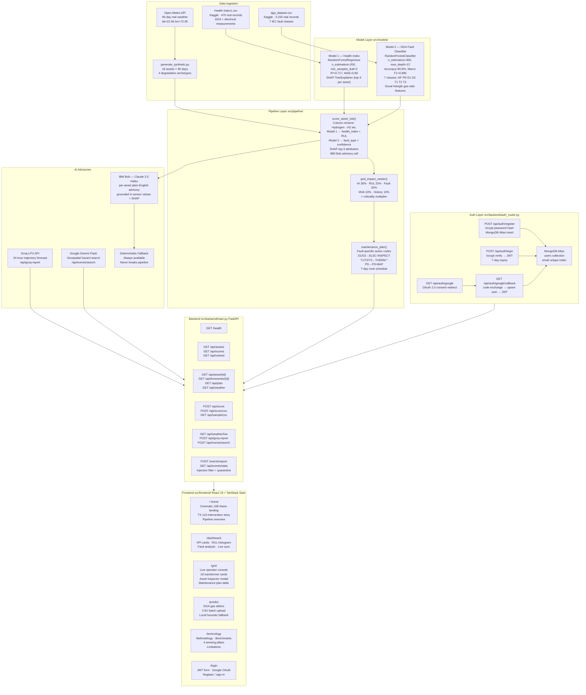

# Architecture — VOLTRA Grid Risk Advisor

## System Architecture Diagram



---

## Component Table

| Component | File | Technology | Responsibility |
|---|---|---|---|
| **Data generator** | `src/data/generate_synthetic.py` | Python, pandas, Open-Meteo API | Creates 18-asset × 90-day timeseries with 4 degradation archetypes |
| **Health Index model** | `src/models/train_health_index.py` | scikit-learn RandomForestRegressor, SHAP | Trains on real Kaggle DGA data; outputs `risk_model.pkl` |
| **DGA Fault Classifier** | `src/models/train_dga_classifier.py` | scikit-learn RandomForestClassifier | Trains on 4,150 real records; outputs `dga_fault_model.pkl` |
| **Risk scorer** | `src/pipeline/score_asset_risk.py` | Python, SHAP, anthropic SDK | Dual model inference + SHAP + IBM Bob advisory |
| **Grid impact ranker** | `src/pipeline/grid_impact_ranker.py` | Python, pandas | 5-component weighted ranking formula |
| **Maintenance planner** | `src/pipeline/maintenance_plan.py` | Python | Fault-type action codes + 7-day crew schedule |
| **FastAPI backend** | `src/backend/main.py` | FastAPI, uvicorn, httpx | 20+ REST endpoints; serves scoring, ranking, weather, CSV |
| **Auth router** | `src/backend/auth_router.py` | FastAPI, pymongo, bcrypt, python-jose, httpx | JWT, bcrypt, MongoDB Atlas, Google OAuth 2.0 |
| **MongoDB Atlas** | Cloud | pymongo | User accounts; email + bcrypt hash; JWT claims |
| **VOLTRA frontend** | `src/frontend/` | React 19, TanStack Start, Vite 8 | 5-route operator console with cinematic landing |
| **API client** | `src/frontend/src/lib/techtonicsApi.ts` | TypeScript, Fetch API | Typed client for all backend endpoints with auth headers |
| **Docker container** | `Dockerfile` + `start.sh` | Docker multi-stage, Node 20, Python 3.11 | Single-port deployment: Nitro SSR on :3000 + FastAPI proxied on :8000 |

---

## Data Flow — End to End

### 1. Training (one-time)
```
Kaggle datasets (auto-downloaded by kagglehub)
  → src/models/train_health_index.py   → src/models/risk_model.pkl
  → src/models/train_dga_classifier.py → src/models/dga_fault_model.pkl
```

### 2. Data generation (one-time)
```
Open-Meteo API → 90-day weather
generate_synthetic.py → transformer_timeseries.csv (1,620 rows)
                      → asset_registry.csv (18 transformers)
                      → incident_log.csv, risk_events.csv, weather.csv
```

### 3. Pipeline scoring (on startup or manual re-run)
```
transformer_timeseries.csv (Day 89 slice)
  → score_asset_risk()
      → column rename (Hydrogen→H2, Methane→CH4, …)
      → Model 1: health_index + RUL_days
      → Model 2: fault_type + fault_probabilities
      → SHAP TreeExplainer: top_3_shap
      → IBM Bob (or fallback): advisory_text
  → grid_impact_ranker(): composite_score + rank
  → maintenance_plan(): top_10_actions + crew_schedule
  → saves: scored_snapshot_day89.csv, ranked_assets.csv, maintenance_plan.json
```

### 4. Runtime API serving
```
FastAPI startup → loads all 3 cached CSVs/JSONs into _cache dict
Browser → GET /api/ranked        → returns ranked_assets.csv records
Browser → GET /api/asset/TX-115  → re-scores latest timeseries row + IBM Bob
Browser → POST /api/score        → ad-hoc sensor reading → ML scores
Browser → POST /api/score/csv    → batch CSV → ML scores for each row
Browser → GET /api/weather/live  → proxies Open-Meteo in real-time
Browser → POST /events/report    → injection filter → MongoDB/CSV log
```

### 5. Authentication flow
```
User → POST /api/auth/register → bcrypt hash → MongoDB insert → JWT
User → POST /api/auth/login    → bcrypt verify → JWT (7-day)
User → GET  /api/auth/google   → redirect to Google consent
Google → GET /api/auth/google/callback → upsert MongoDB → JWT → redirect frontend
Frontend → stores JWT in localStorage → attached to all subsequent API calls
```

### 6. Docker & Single-Server Deployment
```
Stage 1 (Node 20): npm install + vite build → .output/ (Nitro SSR bundle)
Stage 2 (Python 3.11): pip install (src/ + rag-chatbot/ requirements) + copy src/, rag-chatbot/, .output/
start.sh (Supervisor):
  ├── node .output/server/index.mjs on :3000 (SSR internal)
  ├── uvicorn api.main:app on :8001 (RAG FastAPI internal)
  └── uvicorn src.backend.main:app on :$PORT (Public entry: proxies /* to Nitro & /rag/* to :8001)
```

---

## Critical Implementation Detail — Column Name Translation

The two models use different naming conventions for the same five DGA gases. The rename step is applied **inside `score_asset_risk()`**, not in the data layer:

| Data layer name (Model 1) | Model 2 / pipeline name |
|---|---|
| `Hydrogen` | `H2` |
| `Methane` | `CH4` |
| `Ethane` | `C2H6` |
| `Ethylene` | `C2H4` |
| `Acethylene` | `C2H2` |

If this rename is skipped, Model 2 will silently receive wrong column names and fall back to default gas ratios, producing incorrect fault classifications.

---

## RUL Heuristic

No ground-truth RUL labels exist in either Kaggle dataset. The heuristic is calibrated against documented transformer lifecycle literature:

| Health Index Range | Formula | Zone |
|---|---|---|
| HI ≥ 70 | `RUL = max(1, 8 − (HI − 70) × 0.2)` | Critical: imminent failure |
| 50 ≤ HI < 70 | `RUL = max(8, 45 − (HI − 50) × 1.85)` | Severe |
| HI < 50 | `RUL = max(45, 180 − (HI − 13.4) × 3.65)` | Healthy |

---

## IBM Bob Integration Points

IBM Bob (Claude claude-3-5-haiku-20241022) is called in two places:

1. **`score_asset_risk.py` → `generate_advisory_text()`** — per-asset advisory at scoring time; includes actual sensor ppm values and top-3 SHAP feature names + contributions
2. **`maintenance_plan.py` → `_generate_crew_summary_bob()`** — crew pre-positioning briefing

Both have **deterministic fallbacks** that produce sensor-grounded text (not generic boilerplate). The pipeline never raises an exception due to a Bob call failure.

---

## Security Architecture

### Prompt-Injection Defence (`POST /events/report`)
Community reports pass through a two-layer filter before reaching any decision-making code:

1. **Regex first-pass** — scans for patterns: `ignore previous instructions`, `system prompt`, `you are now`, `override`, `jailbreak`, `DAN mode`. Matched submissions are quarantined to `rejected_submissions_log.csv` and never reach the ML pipeline.
2. **Closed-category classifier** — accepted reports are bucketed into: `excavation`, `storm_damage`, `wildfire`, `collision`, `explosion`, `grid_incident`
3. **Bounded multiplier cap** — community reports can only apply a supplementary multiplier ≤ 1.25×; they can **never lower** a risk tier or override physical sensor data
4. **Audit trail** — accepted events logged to `user_reported_events.csv` with `Unverified — user reported` disclaimer

### Auth Security
- Passwords stored as bcrypt hashes (never plaintext)
- JWT signed with HS256, 7-day expiry, email + MongoDB ObjectId in claims
- Google OAuth state cookie verified on callback to prevent CSRF
- 401 responses automatically clear client-side session

---

## Deployment Notes

| Mode | How to run | Notes |
|---|---|---|
| **Local dev** | uvicorn `:8000` + `npm run dev` `:3000` | Two separate processes; CORS open |
| **Docker single-container** | `docker build -t voltra . && docker run -p 8000:8000` | Nitro SSR on :3000 (internal), FastAPI proxies all `/*` |
| **Railway / cloud** | Set env vars + deploy container | `PORT` env var controls FastAPI port |

- No database required for ML endpoints — all pipeline outputs are CSV/JSON in `src/data/`
- MongoDB Atlas is **only required** for user authentication
- IBM Bob, Groq, and Gemini API keys are all optional — graceful fallbacks exist for all three
