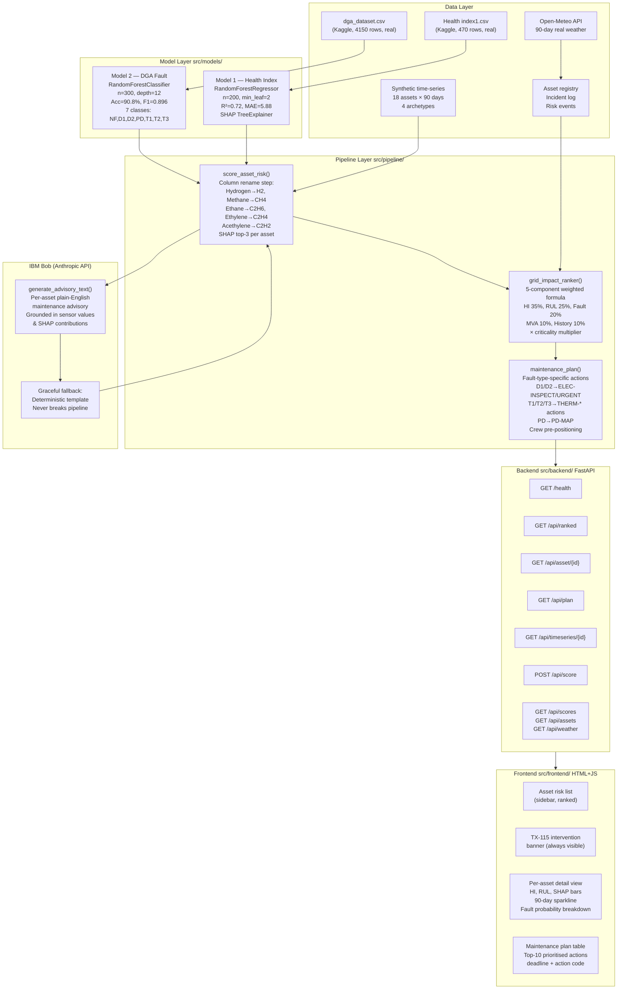

# Architecture

## System Architecture



## Data Flow Detail

### Column Name Translation (CRITICAL)
The two models use different naming conventions for the same five gases. The rename step is applied **in the integration pipeline** (`score_asset_risk.py`), never in the data layer:

```
Data layer (Model 1 names)  →  Model 2 names
Hydrogen                    →  H2
Methane                     →  CH4
Ethane                      →  C2H6
Ethylene                    →  C2H4
Acethylene                  →  C2H2
```

### RUL Heuristic
No ground-truth RUL labels exist in either dataset. The heuristic is calibrated as:
- HI ≥ 70: `RUL = max(1, 8 − (HI − 70) × 0.2)` — steep segment, imminent failure
- HI ≥ 50: `RUL = max(8, 45 − (HI − 50) × 1.85)` — severe zone
- HI < 50: `RUL = max(45, 180 − (HI − 13.4) × 3.65)` — healthy zone

### IBM Bob Integration Points
Bob is called in two places in the live pipeline:
1. **`score_asset_risk.py` → `generate_advisory_text()`**: per-asset advisory at scoring time
2. **`maintenance_plan.py` → `_generate_crew_summary_bob()`**: crew pre-positioning briefing

Both have deterministic fallbacks. The fallback text is grounded in the same sensor values — it is not generic boilerplate.

## Key Files

| File | Purpose |
|---|---|
| `src/data/generate_synthetic.py` | Synthetic data generation with 4 archetypes |
| `src/models/train_health_index.py` | Model 1 training (downloads from Kaggle) |
| `src/models/train_dga_classifier.py` | Model 2 training (downloads from Kaggle) |
| `src/pipeline/score_asset_risk.py` | Integration: both models + rename + SHAP + Bob |
| `src/pipeline/grid_impact_ranker.py` | Composite ranking with explicit weights |
| `src/pipeline/maintenance_plan.py` | Fault-type-specific actions + crew plan |
| `src/backend/main.py` | FastAPI: 9 endpoints, cached startup |
| `src/frontend/index.html` | Single-file dashboard, no build step |

## Deployment Notes

- No database required — all pipeline outputs are CSV/JSON files in `src/data/`
- Single Python process for backend; frontend is a static HTML file
- API key for IBM Bob is optional — fallback mode is fully functional without it
- Kaggle datasets are downloaded automatically on first model training run
